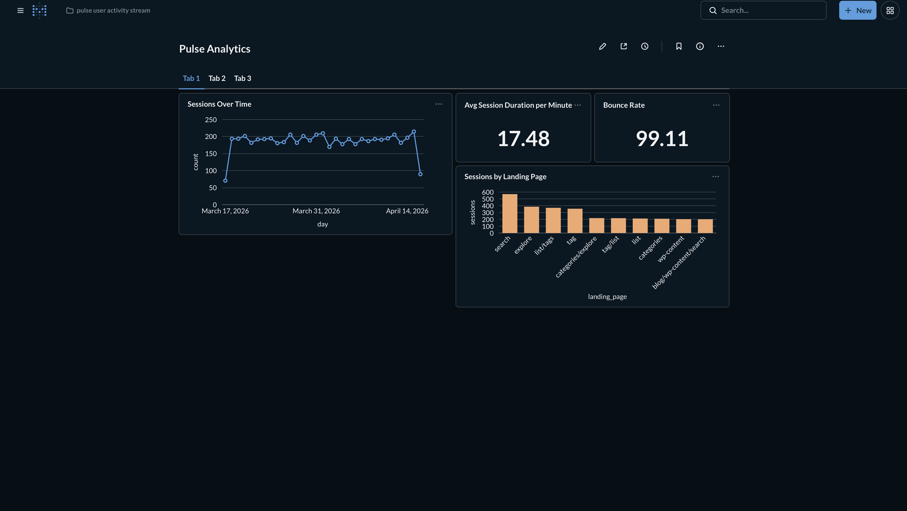
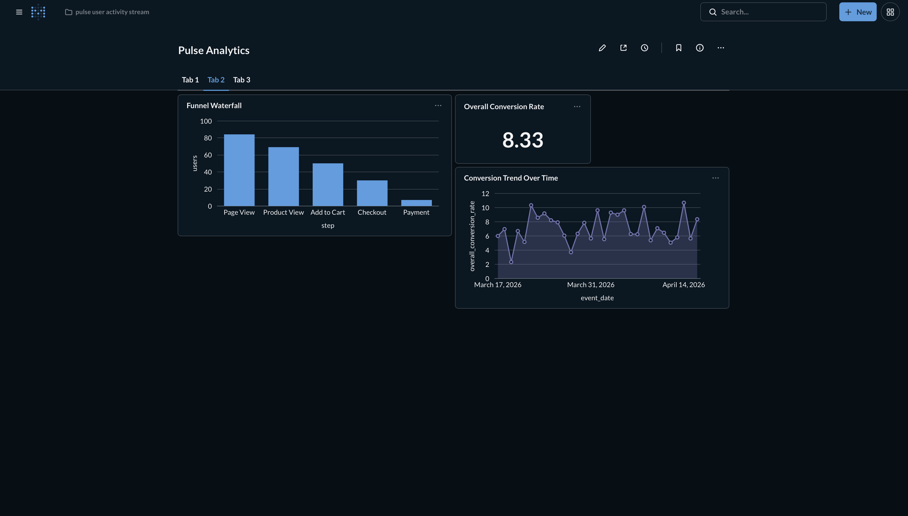
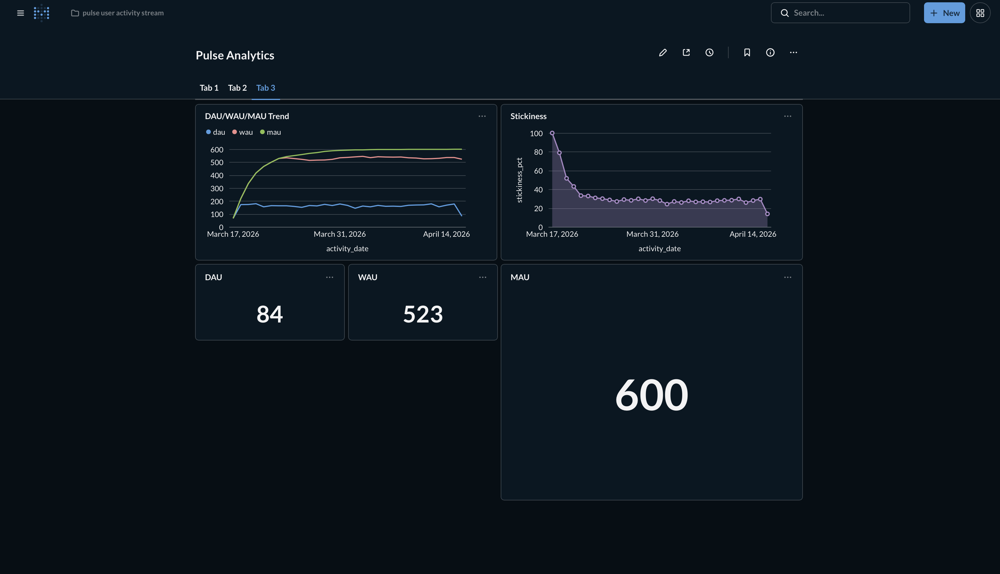

# Pulse

A streaming session analytics pipeline. Simulated clickstream events flow through Kafka into Postgres, where dbt transforms them into session metrics, funnel conversion rates, and user engagement analytics.



## Architecture

```
┌─────────────┐     ┌──────────┐     ┌──────────────┐     ┌──────────┐     ┌───────────┐
│   Event     │     │  Kafka   │     │   Python     │     │ Postgres │     │ Metabase  │
│  Simulator  │────▶│ (KRaft)  │────▶│  Consumer    │────▶│   raw    │────▶│ Dashboard │
│  (producer) │     │          │     │              │     │  events  │     │           │
└─────────────┘     └──────────┘     └──────────────┘     └────┬─────┘     └───────────┘
                         │                                     │
                    ┌────▼─────┐                          ┌────▼─────┐
                    │   DLQ    │                          │   dbt    │
                    │  topic   │                          │ models   │
                    └──────────┘                          └──────────┘
```

## Key Features

- **Idempotent ingestion** — exactly-once semantics via `ON CONFLICT DO NOTHING`
- **30-minute session reconstruction** — industry-standard gap-based sessionization
- **Funnel tracking** — page_view → product_view → add_to_cart → checkout → payment
- **Engagement metrics** — DAU/WAU/MAU with stickiness calculation
- **Dead letter queue** — non-transient errors routed to DLQ topic for inspection

## Dashboards

### Sessions Overview

- Sessions over time
- Average session duration
- Bounce rate
- Sessions by landing page

### Funnel Analysis

- Step-by-step conversion waterfall
- Overall conversion rate
- Conversion trend over time

### User Engagement

- DAU/WAU/MAU trends
- Stickiness (DAU/MAU ratio)
- Current active user counts

## Tech Stack

| Layer | Tool |
|-------|------|
| Message broker | Apache Kafka (KRaft mode) |
| Database | PostgreSQL |
| Transform | dbt |
| BI | Metabase |
| Orchestration | Docker Compose |

## Quick Start

```bash
# Clone and configure
git clone https://github.com/ayoabass777/Pulse.git
cd pulse
cp .env.example .env

# Start infrastructure
docker-compose up -d

# Run producer (generates simulated events)
python producer/producer.py

# Run consumer (Kafka → Postgres)
python consumer/consumer.py

# Build dbt models
cd dbt/pulse_analytics
dbt run
dbt test

# Access Metabase
open http://localhost:3000
```

## Project Structure

```
pulse/
├── producer/           # Event simulator (idempotent Kafka producer)
├── consumer/           # Kafka → Postgres writer (transactional, DLQ-aware)
├── dbt/pulse_analytics/
│   ├── models/
│   │   ├── staging/    # stg_events
│   │   ├── intermediate/ # int_sessions, int_funnels
│   │   └── marts/      # session_metrics, funnel_conversion, daily_active_users
│   └── tests/
├── sql/                # DDL for raw.events
├── docs/               # Data contracts, setup guides, architecture docs
└── docker-compose.yml  # Kafka + Postgres + Metabase
```

## Delivery Guarantees

| Layer | Guarantee | Mechanism |
|-------|-----------|-----------|
| Producer → Kafka | Exactly-once | `enable.idempotence=True` |
| Kafka → Consumer | At-least-once | Manual offset commit |
| Consumer → Postgres | Idempotent | `ON CONFLICT (event_id) DO NOTHING` |
| **End-to-end** | **Effectively exactly-once** | Idempotent key: `user_id:kafka_timestamp_ms` |

### Two Layers of Idempotency

These are **not the same thing** — they solve duplicates at different layers:

| Concept | Layer | Purpose |
|---------|-------|--------|
| `enable.idempotence=True` | Producer → Kafka | Prevents duplicate messages *in Kafka* when producer retries on network timeout |
| Idempotent key (`event_id`) | Consumer → Postgres | Prevents duplicate rows *in Postgres* when consumer replays after crash |

Both are required for end-to-end exactly-once semantics.

## dbt Models

| Model | Type | Description |
|-------|------|-------------|
| `stg_events` | View | Cleaned events from raw.events |
| `int_sessions` | View | Session reconstruction (30-min gap) |
| `int_funnels` | View | Funnel step tracking |
| `mart_session_metrics` | Table | Session-level aggregates |
| `mart_funnel_conversion` | Table | Daily funnel conversion rates |
| `mart_daily_active_users` | Table | DAU/WAU/MAU with stickiness |

## Production Architecture

See [docs/production_architecture.md](docs/production_architecture.md) for the AWS deployment path:

| Local | Production |
|-------|------------|
| Kafka (Docker) | Amazon MSK |
| Postgres (Docker) | Amazon RDS |
| Local files | S3 landing zone |
| Cron / manual | EventBridge + Lambda |

## Related Projects

- **[Ballistics](https://github.com/ayoabass777/ballistics)** — Batch pipeline (API → Airflow → S3 → Postgres → dbt)

Together, these projects demonstrate both batch and streaming paradigms with the same transform layer (dbt).

## Author

**Ayomide Abass**  
Data Engineer | Vancouver, Canada  
[LinkedIn](https://www.linkedin.com/in/ayomide-abass-36b40025a/) · [GitHub](https://github.com/ayoabass777)

## License

MIT
